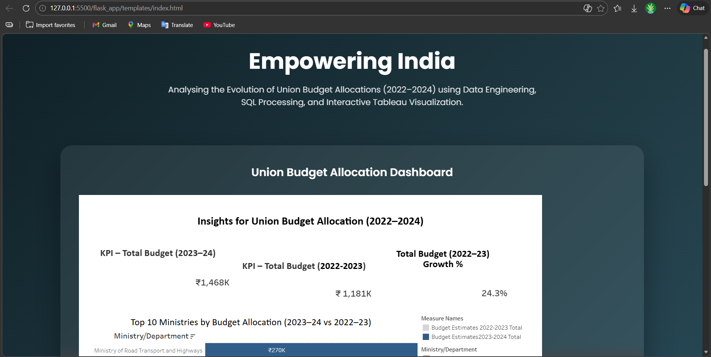

# Empowering India: Union Budget Analytics System

## 1) Title
**Empowering India: Analysing the Evolution of Union Budget Allocations for Sustainable Growth**

## 2) Problem Statement
Businesses and citizens need clear insights into how the Indian government allocates its budget. These allocations impact industries, social sectors, and economic growth. However, raw budget data is complex and not easily accessible for decision-making. There is a need for a data-driven, visual, and interactive system to help users understand trends, sector priorities, and the impact of budget decisions.

## 3) Business Scenarios
- **Renewable Energy Startup:** Needs to track government support for green energy to plan investments.
- **EV Manufacturing Company:** Monitors budget allocations for electric vehicle infrastructure and incentives.
- **Pharmaceutical Company:** Analyses healthcare and pharma allocations to forecast market opportunities.

## 4) Data Collection
The dataset was sourced from Kaggle, containing Union Budget data from 2021 to 2024. Data was stored in MySQL for structured querying and analysis, and then connected to Tableau for visualization.

## 5) Data Preparation
- Removed null values
- Renamed fields for clarity
- Created calculated fields (e.g., growth %)
- Filtered data for years 2021–2024

## 6) Visualizations
- Total Budget Trend
- Category Wise Budget
- Department Wise Budget
- Scheme Wise Budget
- Growth Percentage
- Top 5 Ministries
- Year-wise Comparison

## 7) Dashboard
A main Tableau dashboard was designed to be responsive and interactive, allowing users to filter by year, category, and department. The layout highlights key trends and comparisons.

## 8) Story
A Tableau story guides users through:
- Overview of Budget Growth
- Category Wise Allocation
- Department Wise Analysis
- Scheme Analysis
- Business Scenario Insights

## 9) Web Integration
A Flask web app was developed to embed the Tableau dashboard using the JavaScript API. The UI is responsive and user-friendly, making insights accessible online.

## 10) Performance Testing
- Number of records loaded: 300+
- Calculated fields: 5
- Filters: Year, Category, Department
- Visualizations: 7+
- Dashboard tested for responsiveness on desktop and mobile

## 11) Conclusion
The project reveals clear trends in budget growth and sector priorities. The analytics system helps businesses and citizens make informed decisions based on government allocations, supporting transparency and sustainable development.

## Technologies Used
- MySQL (for database and queries)
- Tableau (for dashboards and stories)
- Python with Flask (for the web app)
- HTML & CSS (for the user interface)

## Project Structure
- `cleaned_data/` - cleaned CSV data
- `dataset/` - raw source dataset
- `flask_app/` - Flask app and templates
- `mysql_scripts/` - SQL scripts for table setup
- `tableau/` - Tableau dashboard/story assets
- `documentation/` - project documentation
- `video/` - demo videos

## Explore Our Tableau Dashboards

### Additional Dashboards

**Budget Comparison Dashboard:**  

**Top 10 Ministries by Budget:**  

**Top 5 Schemes (2021-22):**  

## UI Interface Preview
This is the Flask web app user interface:

## Technologies Used
- MySQL (for database and queries)
- Tableau (for dashboards and stories)
- Python with Flask (for the web app)
- HTML & CSS (for the user interface)

## Project Structure
- `cleaned_data/` - cleaned CSV data
- `dataset/` - raw source dataset
- `flask_app/` - Flask app and templates
- `mysql_scripts/` - SQL scripts for table setup
- `tableau/` - Tableau dashboard/story assets
- `documentation/` - project documentation
- `video/` - demo videos
